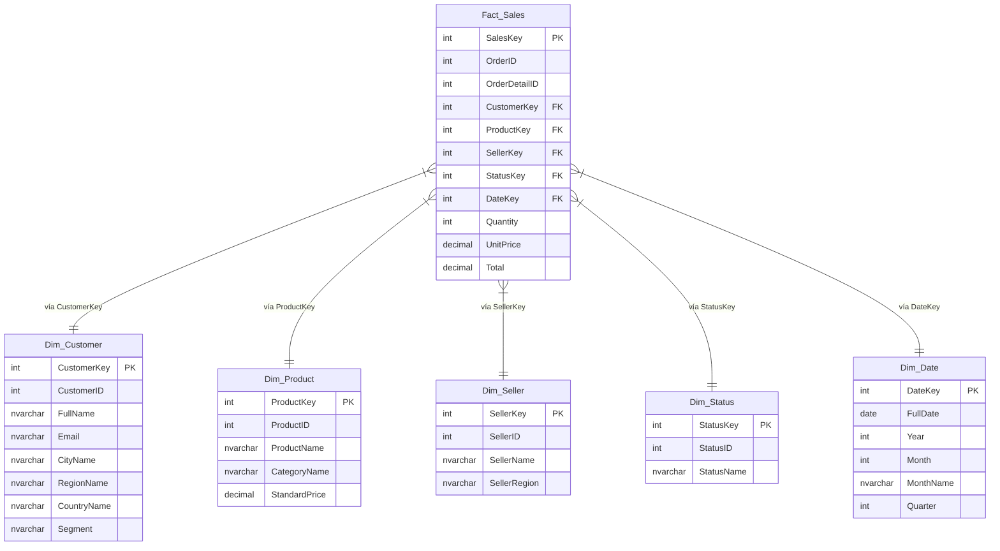

# Reporte Técnico: Decisiones de Diseño y Modelado del Data Warehouse

Este documento detalla el diseño de la base de datos analítica centralizada (Data Warehouse) para el Sistema de Análisis de Ventas, respondiendo a la Actividad 3.1. Sirve como base explicativa para la generación del reporte en PDF.

---

## 1. Justificación del Diseño: Modelo en Estrella (Star Schema)

Para la base de datos analítica se optó por un **Modelo en Estrella (Star Schema)** en lugar de un Modelo en Copo de Nieve (Snowflake Schema). Las razones técnicas detrás de esta decisión son:

*   **Rendimiento en Consultas Analíticas (OLAP):** Al mantener las dimensiones completamente desnormalizadas (por ejemplo, incluyendo el nombre del país y la ciudad directamente en `Dim.Customer` en lugar de crear tablas separadas para países y ciudades), se reduce significativamente la cantidad de combinaciones (`JOIN`) necesarias. Esto incrementa de forma masiva la velocidad de ejecución de consultas complejas y reportes analíticos.
*   **Simplicidad para Herramientas de BI:** Las herramientas modernas de visualización de datos (como Power BI, Tableau o Excel) leen de forma nativa e intuitiva los modelos en estrella. Los usuarios de negocio pueden arrastrar y soltar campos de dimensión para agrupar las métricas de hecho de manera ágil.
*   **Unificación y Consolidación de Historiales:** Permite integrar datos históricos de años anteriores (base de datos externa) con los actuales (archivos CSV y API REST) dentro de una misma estructura física de hechos (`Fact.Sales`), alineándolos en el tiempo a través de una sola dimensión temporal (`Dim.Date`).

---

## 2. Estructura de Capas y Definición de Dimensiones

El modelo estrella divide la base de datos en dos esquemas lógicos bien definidos: `Dim` (para las tablas de dimensiones descriptivas) y `Fact` (para las tablas de hechos numéricos).

### 2.1. Tabla de Hechos
*   **`Fact.Sales`**: El grano más fino del modelo corresponde al detalle de la línea de factura (`OrderDetailID` y `OrderID`). Almacena las métricas cuantitativas clave:
    *   `Quantity` (Cantidad de unidades vendidas).
    *   `UnitPrice` (Precio unitario real al que se facturó).
    *   `Total` (Monto total facturado por producto en esa línea).
    *   Llaves sustitutas foráneas (`CustomerKey`, `ProductKey`, `SellerKey`, `StatusKey`, `DateKey`) que lo conectan con las dimensiones.

### 2.2. Tablas de Dimensiones
*   **`Dim.Customer`**: Desnormaliza la jerarquía geográfica. Contiene `CityName`, `CountryName` y agrega `RegionName` para responder análisis por región. Además, introduce el atributo `Segment` para categorizar a los clientes (ej. Minorista, Mayorista, Corporativo) y permitir análisis de compras segmentadas.
*   **`Dim.Product`**: Desnormaliza el catálogo. Contiene `ProductName`, `CategoryName` y `StandardPrice`. Permite agrupar las ventas según las categorías definidas.
*   **`Dim.Status`**: Contiene la clasificación de entrega (`StatusName`) como *Shipped*, *Cancelled*, *Delivered*, etc., para analizar la fiabilidad y estados de entrega.
*   **`Dim.Date`**: Es la dimensión temporal del Data Warehouse. A partir de la fecha de la orden, calcula y almacena de forma predeterminada el año (`Year`), mes numérico (`Month`), nombre del mes (`MonthName`) y trimestre (`Quarter`), respondiendo a picos de ventas y estacionalidad de productos.
*   **`Dim.Seller` (Dimensión Objetivo - Análisis de Brechas de Datos):**
    *   *Justificación de Diseño:* Se diseña la dimensión `Dim.Seller` y su relación en `Fact.Sales` para satisfacer los requerimientos analíticos del negocio (*"¿Qué vendedores presentan mejor desempeño?"*).
    *   *Gobernanza de Datos:* Se hace constar formalmente que los archivos CSV actuales no proveen la información del vendedor. Sin embargo, el esquema analítico queda diseñado para soportar e integrar esta información en el momento en que se conecte la API REST externa o la base de datos histórica.

---

## 3. Diagrama Entidad-Relación (DER) en Estrella

El siguiente diagrama representa la estructura de base de datos analítica implementada en el script SQL, con relaciones de uno a muchos (`1:N`) desde las dimensiones hacia la tabla de hechos:

---

## 4. Mapeo de Respuestas Estructurales a Preguntas de Negocio

El script SQL [SolucionPreguntasNegocio.sql](file:///C:/Users/Carlos%20Wilfredo/Source/Repos/Analisis-De-Ventas/Database/SolucionPreguntasNegocio.sql) contiene las respuestas automáticas a todas las preguntas del PDF. A continuación, se detalla qué componentes del modelo resuelven cada bloque:

*   **Análisis general de ventas:** Resuelto mediante funciones agregadas (`SUM`, `AVG`) en `Fact.Sales` filtradas y unidas con `Dim.Date` y `Dim.Customer` (para geografía).
*   **Ventas por producto:** Resuelto cruzando `Fact.Sales` y `Dim.Product`, permitiendo ordenar los ingresos y unidades de forma descendente (para productos más vendidos) y ascendente (para rotación baja).
*   **Ventas por cliente:** Resuelto agrupando transacciones por `CustomerKey` en `Fact.Sales` y filtrando por `Segment` en `Dim.Customer`.
*   **Tendencias temporales:** Resuelto al agrupar por las columnas `Year`, `Quarter` y `MonthName` de la dimensión `Dim.Date`.
*   **Comparativas y Desempeño:**
    *   El desempeño de vendedores se obtiene uniendo `Fact.Sales` con `Dim.Seller` agrupando por `SellerName`.
    *   La comparativa anual se logra mediante un `PIVOT` o suma condicional `SUM(CASE WHEN Year = ...)` cruzando `Fact.Sales` con `Dim.Date` sobre los datos consolidados.
*   **KPIs:** Métricas como crecimiento porcentual consecutivo se resuelven utilizando la función de ventana `LAG` sobre agrupaciones temporales de ventas mensuales.
